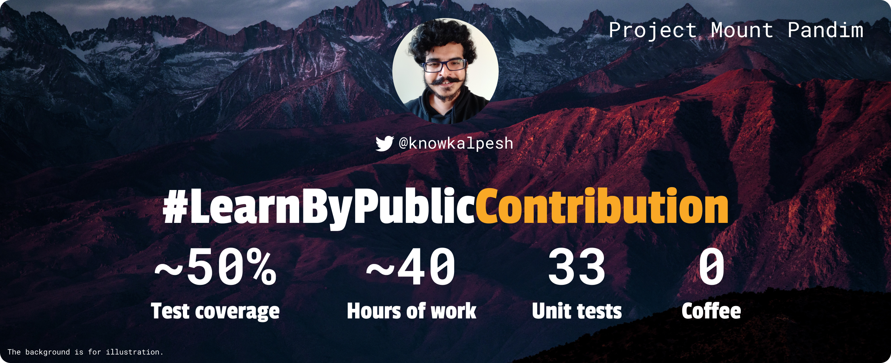
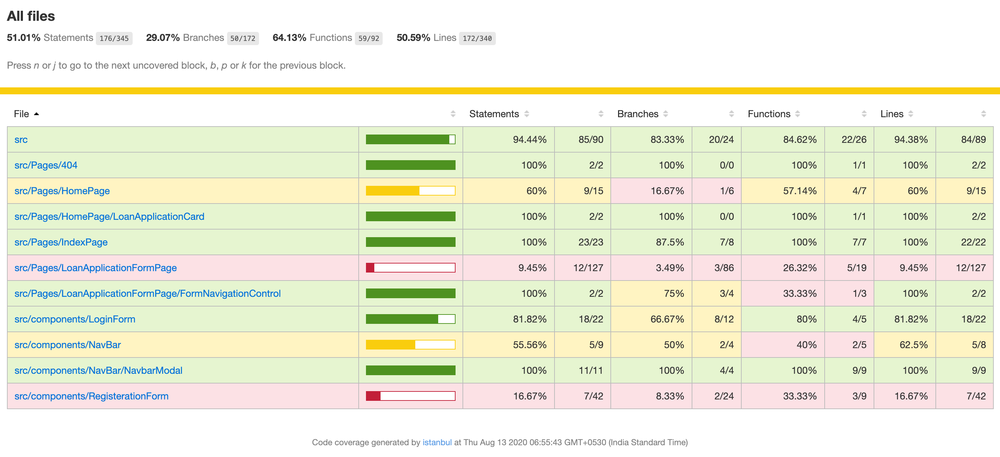

#LearnByPublicContribution

Developer, developer, developer!

I recently started learning by making a contribution to public projects (community, side project, etc.). In fact, this is my first project where I learned and applied my newly acquired testing skills. I really enjoyed the journey of contributing to an unknown codebase. 

The project was small enough to spark my interest and contribution. The project is bootstrapped using Create React App and didn't have any specific testing configuration. I used Jest and Testing Library React to introduce unit testing in the project and declared victory by providing around 50% testing coverage to the project. I feel awesome about it. 😎

It's been one hell of a ride. Sometimes I spent days on petty issues other time struggled with the obsession of refactoring and making test cases more clear and modular. It was worth in terms of learning a new skill and gaining confidence about new learnings. The latter is more important to me.

### Project details
| Project name | [exercise-arab](https://github.com/vipulbhj/exercise-arab) |
|-|-|
| Description | A small side project bank's loan management |
| Original repository owner | [Vipul Bhardwaj](https://github.com/vipulbhj) |
| Framework | ReactJs (using Create React App) |

### Visual satisfaction

### Struggles and Learnings
I was struggling to understand concepts and once I dig down I understood a few things. I started learning by consuming [KCD](https://twitter.com/kentcdodds)'s [Testing JavaScript](https://testingjavascript.com/) course. I documented my questions and learning to convert them into a blog post on my [blog](https://kalpeshsingh.svbtle.com/).

- How to test promised function and callback function? What is the role of `done()` method and when to use it?
- What is difference between `Jest.mock`, `jest.fn ` and `jest.spyOn`.
- `toBeTruthy` vs `toBe(true)` - Seems minor but made a mistake here
- When to use `afterEach`, `beforeEach`, `afterAll`, and `beforeAll`?
- How to write a good description of test cases? I still struggle here.
- How to mock global functions such as `localStorage`, `fetch`, etc.?
- Did you know that `process.env.NODE_ENV` for CRA (Create React App) is always set to `test` in development? You can override in the test.
- `return` keyword in all promise based function. This is where I felt stupid.
- Do you know that CRA has its own convention of adding external configuration or overriding them? You need to place `setupTest.js` in in `src/` folder in order to get picked up by `Jest` in CRA. I found 
- [Official CRA website is gem](https://create-react-app.dev/) 💎. It saved frustration and time. 
- I also bookmarked a few Stackoverflow answers that helped me during this project.

The list doesn't end here, I have tons of learning and excited to share with you all.
